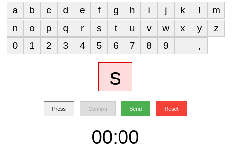

https://onemillionchacters.com

# how to run the app
## How to run this demo

```bash
npm install
```
# Follow setup of [y-sweet.cloud/docs setup](https://y-sweet.cloud/quickstart) to get your connection string
# create .env file with 
```bash
echo "CONNECTION_STRING=<YOUR_CONNECTION_STRING>" > .env
```
```bash
npm run dev
```
### In another terminal
```bash
npm run server
```
### if `npm run server` fails you need a [y-sweet.cloud](https://y-sweet.cloud/quickstart) api key. ex:  `yss://......../`
```bash
CONNECTION_STRING=<your-connection-string> npm run server
```
## Open [localhost:3000](http://localhost:3000) in your browser.

## Success!

----

# Dev log
##  version 1


# v2 missing live count down


a step backwards


# working on the interface


# i like the idea of the buttons for each letter (and optional advaced users do )

- add press button to set chacter
- add charset [A-Z 0-9 Space \,]
- add confitty on send 
- make text box red when confirmed
- start send grayed out and when confirmed is pressed hit send

# wow that looks great

- remove A-Z only a-z
- popup when send is pressed and timer is not 0 minutes say "Please wait until you can add you next chacter"
- make count down time really big
- if the chacter set
- add a reset button : allow reset if send is not clicked
- 

- 
- 'confirm, reset, send (size huge)'
-


- changed wait timer to 10 seconds

- add delete chacter button
- make delete chacter add 30 seconds the the timer
- add a note saying "delete adds 30 seconds to the timer, send adds 10"


- add display as qwerty format
qwertyuiopasdfghjklzxcvbnm ,0123456789


- fix counting in seconds
- merge confirm and send 
- change confirm button into send button when clicked
- when confirm button is pressed display are you sure?
- change delete button to disabled when counter is above 0 seconds 


- change reset to undo
- change confirm button to Submit (every 10 second)
- change detete chacter  button to "delete character (adds 20 seconds)


- change undo button to disabled when counter is above 0 seconds  
- always count down the timer every second

# try number 2

- fix qwert 


- set deault to 0
- please wait <wait_count>
- on submit add to wait_count + 10 seconds

- 


- simplify disable


- i like the organization of the rows better

- looks like shit but works


- padding needs to be fixed

- size needs to be fixed


# went a different direction

- missing char input keyboard


- workds but has weird user flow around entering
- fix coloring issue with boxes
# TODO

- first row 10, second row 9, third row 
- add big COUNTER NUMBER OF CHACTERS left

- todo add fancy slight rotate when mouse hovers over letter select box
- add sound effect when select box
- add big sound effect when send
- add confitty!


# License MIT @ oran collins 2024