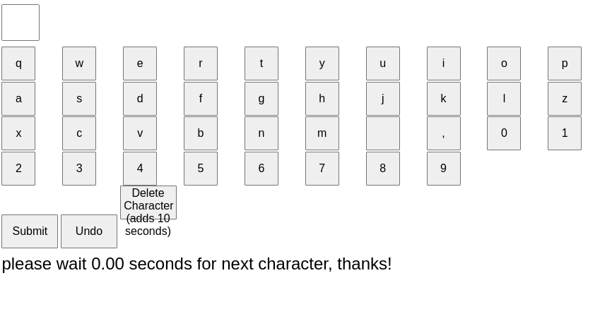

https://onemillionchacters.com

# how to run the app
## How to run this demo

```bash
npm install
```
```bash
npm run dev
```
### In another terminal
```bash
# npm run server
npx y-sweet@latest serve ./persist --host 0.0.0.0 --port 8080

```

## Open [localhost:3000](http://localhost:3000) in your browser.

## Success!

# Prod install
## install caddy
```bash
sudo apt install -y debian-keyring debian-archive-keyring apt-transport-https curl
curl -1sLf 'https://dl.cloudsmith.io/public/caddy/stable/gpg.key' | sudo gpg --dearmor -o /usr/share/keyrings/caddy-stable-archive-keyring.gpg
curl -1sLf 'https://dl.cloudsmith.io/public/caddy/stable/debian.deb.txt' | sudo tee /etc/apt/sources.list.d/caddy-stable.list
sudo apt update
sudo apt install caddy
caddy --help
```
# run 
```bash
sudo cady run
```
# stop
```bash
sudo cady stop
```
# reload
```bash
sudo cady reload
```

# build 
```bash
npm install
npm run build
```
# Create system service
```bash

npx y-sweet@latest serve /home/o/github/million_characters/persist --host 0.0.0.0 --port 8080
sudo nano /etc/systemd/system/y-sweet.service

```
# Copy this to the file
```bash
[Unit]
Description=Y-Sweet Service
After=network.target

[Service]
ExecStart=/usr/bin/npx y-sweet@latest serve /home/o/github/million_characters/persist --host 0.0.0.0 --port 8080
WorkingDirectory=/home/o/github/million_characters/persist
Restart=always
User=o 
Group=o
Environment=NODE_ENV=production

[Install]
WantedBy=multi-user.target

```
# if everything was done correctly
```bash
sudo systemctl daemon-reload
```
# start the sevice
```bash
sudo systemctl start y-sweet.service
sudo systemctl enable y-sweet.service

```
# how to check if its workdin
```bash
sudo systemctl start y-sweet.service
```


----

# Dev log
##  version 1


# v2 missing live count down


a step backwards


# working on the interface


# i like the idea of the buttons for each letter (and optional advaced users do )

- add press button to set chacter
- add charset [A-Z 0-9 Space \,]
- add confitty on send 
- make text box red when confirmed
- start send grayed out and when confirmed is pressed hit send

# wow that looks great

- remove A-Z only a-z
- popup when send is pressed and timer is not 0 minutes say "Please wait until you can add you next chacter"
- make count down time really big
- if the chacter set
- add a reset button : allow reset if send is not clicked 

- 
- 'confirm, reset, send (size huge)'


- changed wait timer to 10 seconds

- add delete chacter button
- make delete chacter add 30 seconds the the timer
- add a note saying "delete adds 30 seconds to the timer, send adds 10"


- add display as qwerty format
qwertyuiopasdfghjklzxcvbnm ,0123456789


- fix counting in seconds
- merge confirm and send 
- change confirm button into send button when clicked
- when confirm button is pressed display are you sure?
- change delete button to disabled when counter is above 0 seconds 


- change reset to undo
- change confirm button to Submit (every 10 second)
- change detete chacter  button to "delete character (adds 20 seconds)


- change undo button to disabled when counter is above 0 seconds  
- always count down the timer every second

# try number 2

- fix qwert 


- set deault to 0
- please wait <wait_count>
- on submit add to wait_count + 10 seconds

- 


- simplify disable


- i like the organization of the rows better

- looks like shit but works


- padding needs to be fixed

- size needs to be fixed


# went a different direction

- missing char input keyboard


- workds but has weird user flow around entering
- fix coloring issue with boxes
# TODO

- first row 10, second row 9, third row 
- add big COUNTER NUMBER OF CHACTERS left

- todo add fancy slight rotate when mouse hovers over letter select box
- add sound effect when select box
- add big sound effect when send
- add confitty!

- add multiple pages [page 1][current page][page3] like mac finder with images displayed
- host ysweet server on cloudflare
   - [Running a Cloudflare Workers dev server](https://github.com/jamsocket/y-sweet/blob/main/docs/running.md)

# TODO
- x host online
- x add mouse pointers
- x  get multiple mouse pointers rendering
- add startup script.sh
- create a service daemon
- fix delete
- x add total char counter
 - show spaces
- fix mouse perposinality with screen size
- add skip to line number

# Juice & Bugs 
- [x] change font
- [x] line number jump
-[x]  'YOU have typed X letters'
-[x]  make line number bottom left float
- [x]  888888 letters are ⌨️ typed!
- [x] add "final book published on amazon" "Will be published on Amazon books"
- add horizonta line
- create a logo?
- ~ fix char count :non space
- current selected char small 
- confetti message "youve placed 1 character!, 
  - you have placed log 10 characters, congrats youve placed floor (PI 🥧) characters
- ~ add slowly following mouse cursor, with nice tweening
- add CLOCK with countdown next to cursor
# sprint two after feedback
- remove 1 character at a time
- make it clear to add your own
  - add "Please Edit the page!, and have fun"

- "make font big"
- add amazon logo book
- ditch books
- fix chrome book bug
- add sound effect of hovering
- add tutorial
# helpful links in dev
- [y-sweet/examples/vanilla at main · jamsocket/y-sweet](https://github.com/jamsocket/y-sweet/tree/main/examples/vanilla)
- [Awareness | Yjs Docs](https://docs.yjs.dev/api/about-awareness)
- [A five minute guide to make an editor collaborative | Yjs Docs](https://docs.yjs.dev/getting-started/a-collaborative-editor)
# License MIT @ oran collins 2024
